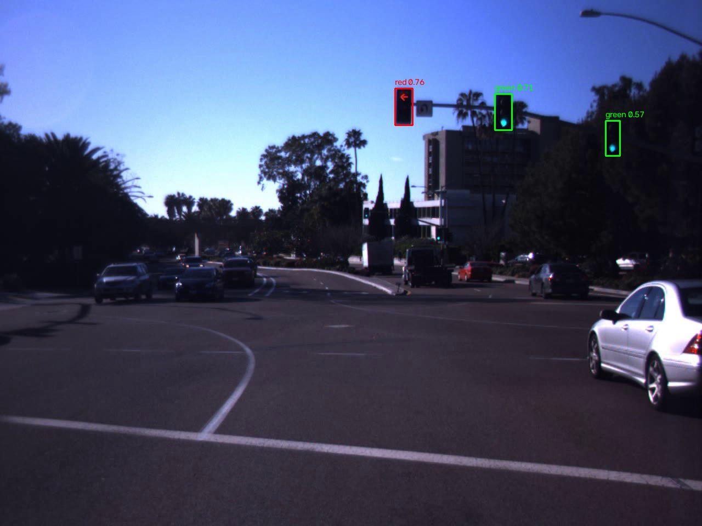
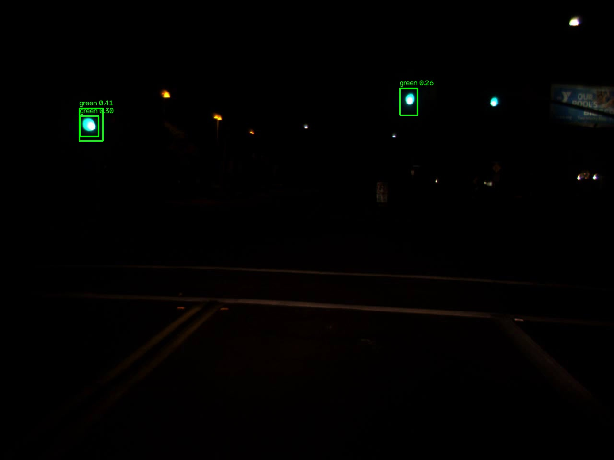

# Traffic Light Detection & Color Classification

Detects traffic lights in road images with a YOLO detector, classifies each
light's state (red/yellow/green) with HSV color analysis, and evaluates accuracy
against labeled ground truth. Results are logged to CSV and summarized with
Matplotlib.

**Stack:** Python, OpenCV, Ultralytics YOLO, PyTorch, NumPy, Matplotlib

Built phase by phase - see [plan.md](plan.md) for the full build plan and design
rationale behind each decision below.

| Day | Night |
|---|---|
|  |  |

## Setup

```
python -m venv .venv
.venv\Scripts\activate
pip install -r requirements.txt
python -c "import cv2, ultralytics, numpy, matplotlib"   # confirm it works
```

## Quick demo (no dataset download needed)

```
python -m tools.detect_input_samples
```

Runs detection + color classification over the 10 sample images committed in
`input/` and saves annotated copies to `input/detected/` (the images above are
two of them). These are frames from the LISA dataset (see [Data](#data)), picked
because the detector is already known to read them correctly.

## Running the full pipeline

```
python -m src.main                    # pretrained detector (default, see below)
python -m src.main --weights custom   # the fine-tuned detector instead
python -m src.main --weights path/to/other.pt
```

One command: runs detection + color over the dataset subset, scores it against
ground truth, and generates all plots. Takes ~2.5-3 minutes on a CPU-only
machine, and prints a summary of every file written at the end.

**Dataset scope:** the full LISA dataset is ~43k images (~1hr to process on
CPU), so by default this runs a subset - `dayClip1/5/7`, `nightClip1/2`, every
5th frame (2,090 images, 6,795 boxes found). A full run is available via
`run_pipeline()`'s defaults in `src/pipeline.py`.

## Project layout

```
src/
  config.py     HSV ranges + tunable thresholds
  color.py      classify_color(crop) -> red/yellow/green/unknown
  detect.py     YOLO detection + annotation drawing
  pipeline.py   run detect+color over the dataset, write results.csv
  evaluate.py   IoU matching, precision/recall, color confusion matrix
  report.py     plots: color counts, confusion matrix, example grid
  main.py       one-command entrypoint
tools/
  convert_labels.py     LISA CSV -> YOLO labels + train/val split
  train.py               fine-tune YOLO on the split
  compare_detectors.py   pretrained vs. custom recall/precision
  validate_color.py      manual classify_color() spot-check
  detect_input_samples.py   the quick demo above
configs/data.yaml   YOLO dataset config for training
input/              10 sample images + detected/ annotated output (committed)
data/               LISA dataset (git-ignored, not committed - see Data below)
outputs/            results.csv, plots, trained weights (git-ignored)
```

## Custom-trained detector

A YOLOv8n model was fine-tuned on a small LISA subset, entirely on CPU
(`python -m tools.train`, ~15 min - see `configs/data.yaml`, `tools/train.py`):

- Train: `dayClip1`, `dayClip5`, `nightClip2` (511 images) / Val: `dayClip7`,
  `nightClip1` (151 images, different clips than train)
- 15 epochs, imgsz 416 → val Precision 0.722, Recall 0.702, mAP50 0.651

**Pretrained vs. custom**, measured on the held-out val clips only:

| Model | Recall | Precision |
|---|---|---|
| Pretrained (`yolov8n.pt`) | 0.783 | 0.774 |
| Custom (`best.pt`) | 0.585 | 0.923 |

**Pretrained is used as the default.** Custom training traded recall for much
higher precision rather than winning outright - for a monitoring system, a
missed light (recall) matters more than an extra false positive. This is a
compute-constrained result (511 images, 15 epochs), not a verdict on fine-tuning
in general; more data/epochs would plausibly close the gap. The custom model
stays available via `--weights custom`.

## Accuracy evaluation

`python -m src.evaluate` scores predictions against ground truth via IoU matching
(detection) and, over what was actually detected, color accuracy:

- **Detection (IoU >= 0.5):** precision 0.361, recall 0.388. Weaker than the
  pretrained-vs-custom table above because it's measured over 5 clips instead of
  2 - `dayClip5` (a dusk, backlit clip) drags the average down.
- **Color accuracy: 96.9%** (2379/2455 correctly-detected lights). The one real
  confusion: 19 `yellow` lights read as `red` - overexposed yellow measures at
  hue 0-11 at the pixel level, statistically indistinguishable from red.

## Data

**[LISA Traffic Light Dataset](https://www.kaggle.com/datasets/mbornoe/lisa-traffic-light-dataset)**
(Kaggle, ~5GB extracted) goes in `data/lisa/` (git-ignored).

```
data/lisa/
  dayTrain/dayTrain/dayClip<N>/frames/dayClip<N>--<frame>.jpg      training clips, day
  nightTrain/nightTrain/nightClip<N>/frames/...                    training clips, night
  daySequence1/2, nightSequence1/2                                 test sequences
  Annotations/Annotations/<clip name>/frameAnnotationsBOX.csv      ground truth
```

(Each top-level folder has one redundant nested copy of itself, e.g.
`dayTrain/dayTrain/...` - a quirk of this Kaggle mirror.)

`frameAnnotationsBOX.csv` is `;`-separated; `Annotation tag` maps to our 3 colors:

| Tag(s) | Color |
|---|---|
| `go` | green |
| `stop`, `stopLeft` | red |
| `warning`, `warningLeft` | yellow |

## Limitations & future work

- **Small/distant lights are the dominant failure mode** - low detection recall
  is a detection problem, not a color one. Pretrained YOLOv8n wasn't trained
  with tiny, distant traffic lights as a priority class.
- **Backlit/dusk conditions break color reading, not just detection** - a dark
  housing silhouetted against a bright sky correctly falls back to `unknown`
  rather than guessing, which is the right behavior but still scores as a miss.
- **Red/yellow confusion under overexposure** is a real limit of HSV-only
  classification (see above) - not fixable by re-tuning without breaking real
  red crops the other way.
- **HSV thresholds are tuned on LISA (US) lights only** - lamp color, housing
  style, and typical exposure differ elsewhere (e.g. Israeli intersections), so
  these thresholds aren't guaranteed to transfer without re-validating locally.
- **This project only ever ran on a subset** of LISA (2,090 of ~43k images) for
  CPU iteration speed; a full run would likely shift the numbers somewhat.

**Future work:** video + tracking for duration analysis (how long was a light
red?) - the original approach before pivoting to images for measurable
accuracy; a longer/larger training run now that the pipeline is proven correct;
and testing against non-US footage to see how far the HSV thresholds transfer.
